# ❤️ DatingApp – Laravel Web Application

DatingApp je web aplikacija za upoznavanje korisnika razvijena pomoću **Laravel framework-a**.
Aplikacija omogućava registraciju korisnika, kreiranje profila, pregled drugih korisnika, lajkove, dislajkove i pronalaženje međusobnih podudaranja (**match sistem**).

---

## 📌 Osnovne funkcionalnosti

- ✔ Registracija i prijava korisnika
- ✔ Kreiranje i uređivanje profila
- ✔ Upload profilne slike
- ✔ Galerija slika korisnika
- ✔ Pregled drugih korisnika
- ✔ Like / Dislike sistem
- ✔ Match sistem
- ✔ Undo like/dislike
- ✔ Statistika korisnika
- ✔ Eksterni API (mapa lokacija korisnika)

---

## 🛠 Korištene tehnologije

- Laravel 10 – PHP framework za brzi razvoj web aplikacija
- PHP – serverski jezik za dinamičke web stranice
- MySQL – relacijska baza za čuvanje podataka
- Blade Templates – Laravel-ovi HTML šabloni sa PHP logikom
- Tailwind CSS – brzo stilizovanje pomoću utility klasa
- Jetstream Auth – gotov sistem za login, registraciju i 2FA
- Leaflet.js – lagana JavaScript biblioteka za interaktivne mape

---

## 🗄 Baza podataka

Aplikacija koristi relacijsku bazu podataka sa sljedećim tabelama:

- users
- profils
- profil_slikes
- likes
- dislikes

---

## 🌱 Seeders i Factories

Projekt sadrži:

✔ Factories za:

- User
- Profil
- ProfilSlika
- Like
- Dislike

✔ Seeders koji generišu:

- 10 korisnika
- 10 profila
- galerije slika
- like/dislike odnose

Pokretanje seedera:

```
php artisan migrate:fresh --seed
```

---

## 👤 Korisnički profil

Svaki korisnik može imati jedan profil koji sadrži:

- ime
- prezime
- datum rođenja
- spol
- grad
- opis
- profilnu sliku
- galeriju slika
- interesovanja
- minimalne godine partnera
- maksimalne godine partnera

---

## ❤️ Match sistem

Korisnici mogu:

- lajkovati profile
- dislajkovati profile
- poništiti like/dislike

Match nastaje kada:

✔ dva korisnika lajkuju jedan drugog

U match sekciji moguće je:

- vidjeti match korisnike
- otvoriti chat (demo verzija)

---

## 🖼 Galerija slika

Korisnici mogu:

- ✔ upload više slika
- ✔ brisati slike
- ✔ pregledati galeriju drugih korisnika

---

## 📊 Statistika

Dashboard prikazuje:

- ✔ broj korisnika
- ✔ procent muškaraca i žena
- ✔ starosnu strukturu
- ✔ prosječnu starost
- ✔ najčešće gradove

---

## 🗺 Mapa korisnika (External API)

Dashboard sadrži mapu koja prikazuje:

- ✔ gradove korisnika
- ✔ raspored korisnika po lokacijama

Koristi se:

Leaflet.js API

---

## 📷 Screenshots

### Login

<p align="center">
  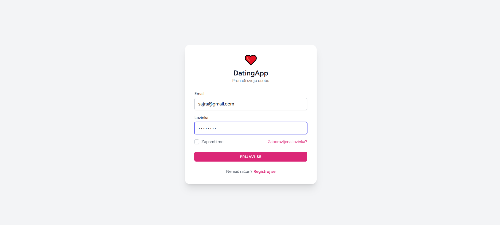
</p>

---

### Registracija

<p align="center">
  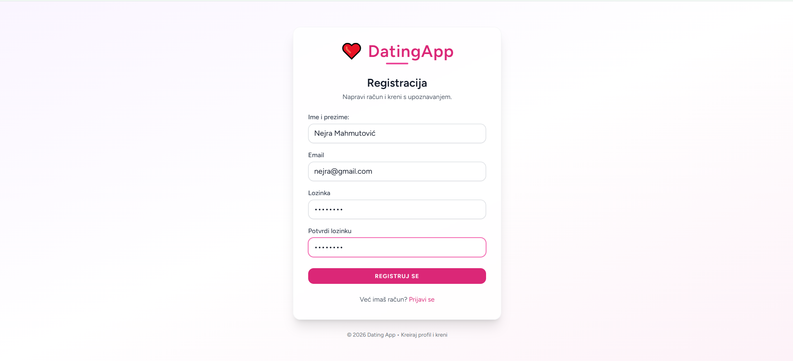
</p>

---

### Kreiranje računa

<p align="center">
  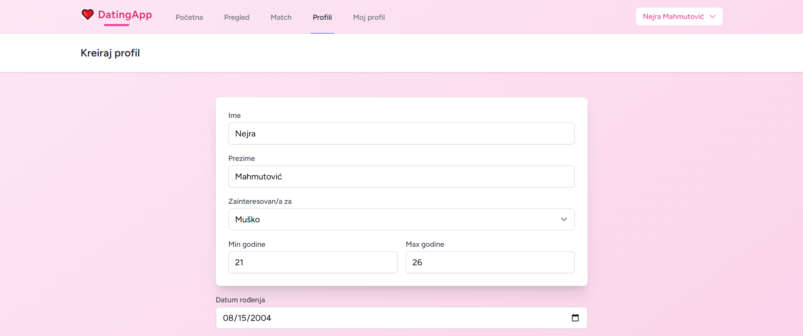
</p>
<p align="center">
  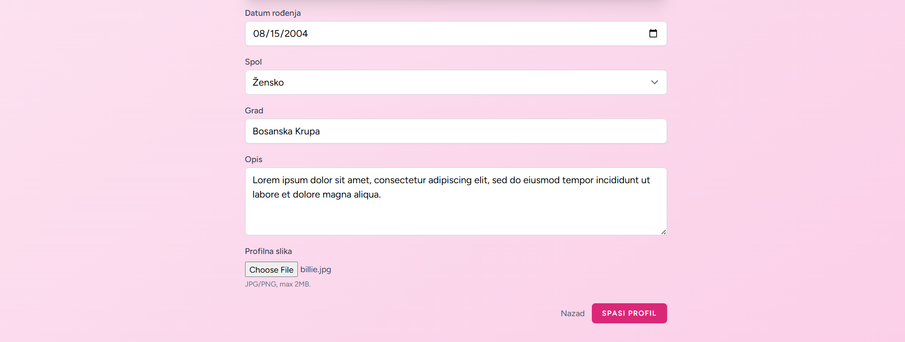
</p>

---

### Dashboard

<p align="center">
  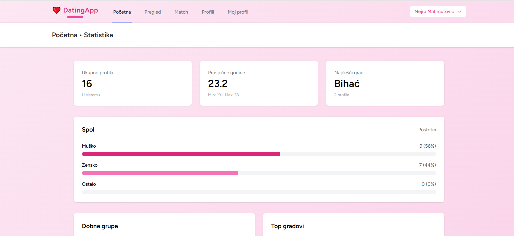
</p>
<p align="center">
  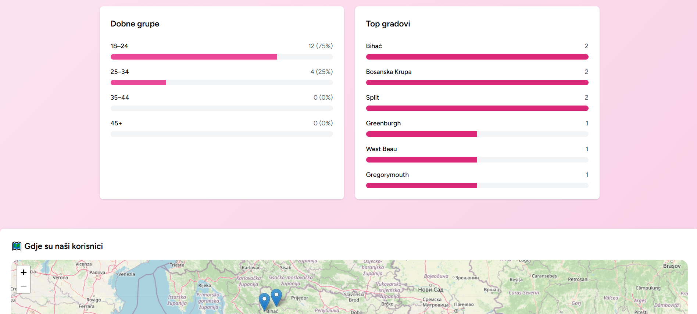
</p>
<p align="center">
  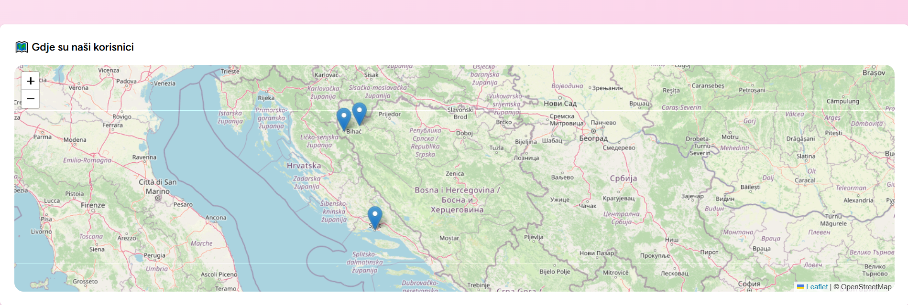
</p>

---

### Pregled profila

<p align="center">
  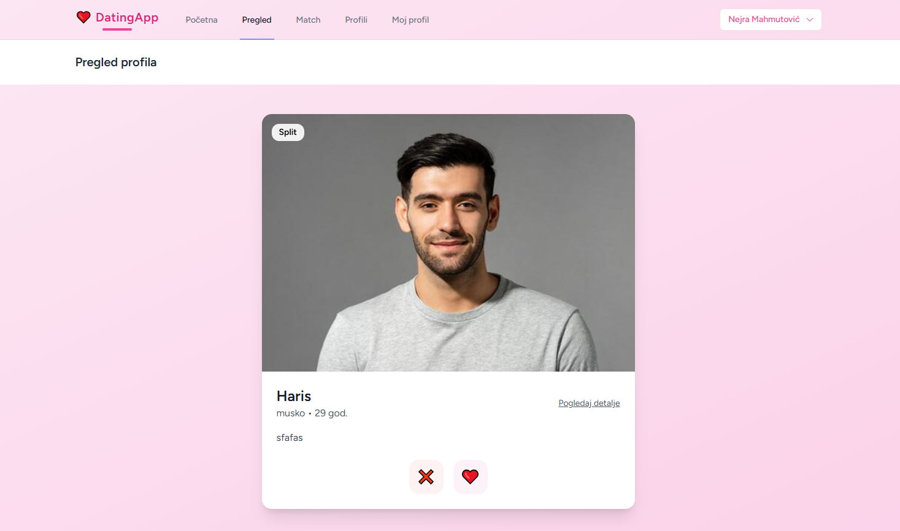
</p>

---

### Moj profil

<p align="center">
  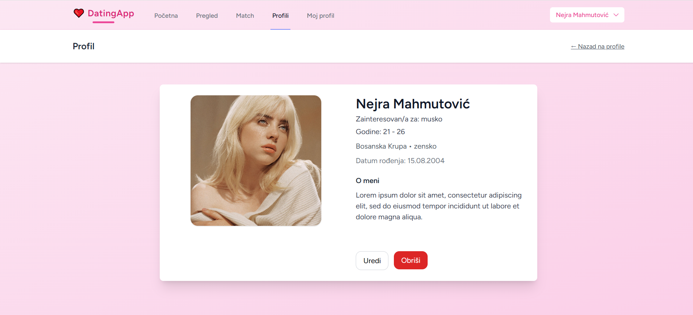
</p>
<p align="center">
  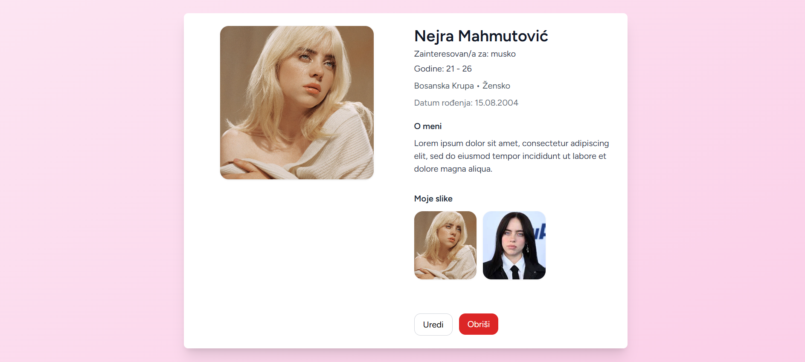
</p>

---

### Profili ostalih korisnika

<p align="center">
  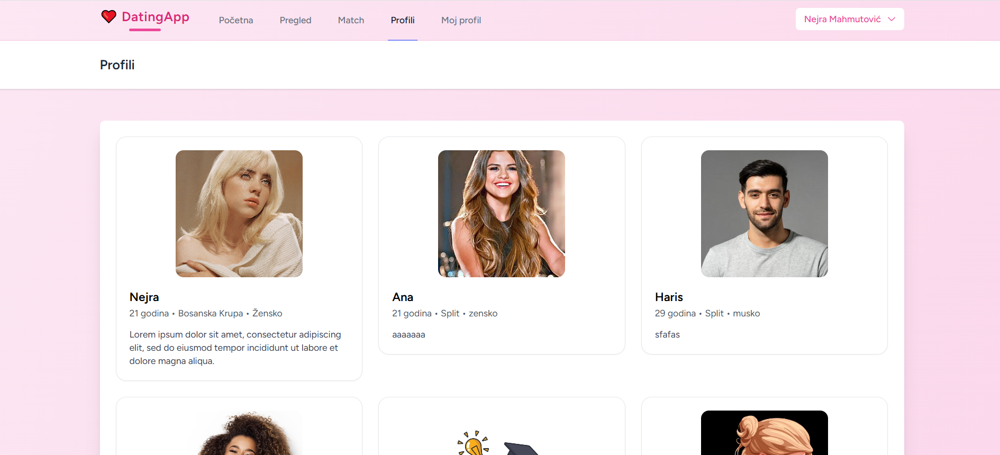
</p>
<p align="center">
  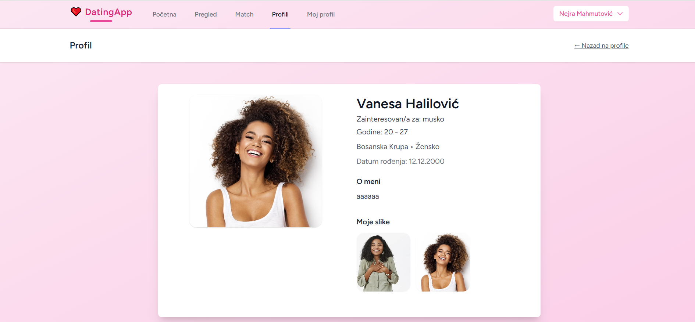
</p>

---

### Match sistem

<p align="center">
  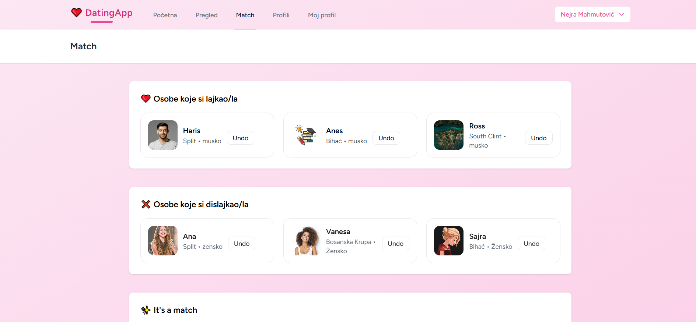
</p>
<p align="center">
  
</p>

---

---

## 🚀 Pokretanje projekta

1️⃣ Kloniranje projekta

```
git clone https://github.com/tvoj-username/datingapp.git
```

2️⃣ Instalacija

```
composer install
```

3️⃣ Konfiguracija

```
cp .env.example .env
```

4️⃣ Generisanje ključa

```
php artisan key:generate
```

5️⃣ Migracije i seeders

```
php artisan migrate:fresh --seed
```

6️⃣ Pokretanje servera

```
php artisan serve
```

---

## 🔐 Autentifikacija

Aplikacija koristi:

Laravel Jetstream Authentication

Omogućeno:

- ✔ Registracija
- ✔ Login
- ✔ Logout
- ✔ Email verifikacija

---

## 🐘 PostgreSQL

PostgreSQL je napredni relacijski sistem za upravljanje bazom podataka koji koristi relacijski model i SQL jezik. U odnosu na MySQL nudi proširene mogućnosti i veću fleksibilnost pri radu sa podacima.

Karakteristike:

- relacijski model podataka

- podrška za napredne tipove podataka

- stabilan i pouzdan sistem

- podrška za kompleksne SQL upite

- kompatibilnost sa Laravel ORM sistemom

Zbog velike sličnosti sa MySQL bazom podataka, migracija aplikacije DatingApp sa MySQL-a na PostgreSQL ne zahtijeva izmjene aplikacione logike.

Laravel Eloquent ORM omogućava nezavisnost aplikacije od konkretnog sistema baze podataka, pa je prelazak moguć uz minimalne izmjene konfiguracije.

---

## 🍃 MongoDB

MongoDB je NoSQL baza podataka koja koristi dokumentni model podataka umjesto relacijskog modela zasnovanog na tabelama.

Karakteristike:

- podaci se čuvaju u JSON dokumentima

- nema klasičnih tabela i relacija

- fleksibilna struktura podataka

- mogućnost ugniježđavanja podataka

- nema stranih ključeva niti JOIN operacija

Za razliku od MySQL i PostgreSQL baza podataka, MongoDB zahtijeva drugačiji pristup modeliranju podataka i implementaciji relacija između entiteta.

---

## 🗄️ Izbor i implementacija baze podataka

U projektu **DatingApp** analizirane su tri baze podataka:

- **MySQL** (početna implementacija)
- **PostgreSQL** (migrirana alternativa)
- **MongoDB** (teorijska analiza i moguća migracija)

### Relacijske baze (MySQL i PostgreSQL)

Koriste strukturirani model sa tabelama i jasno definisanim relacijama.  
Ovakav pristup omogućava:

- jasne odnose između entiteta
- očuvanje integriteta podataka
- jednostavno upravljanje korisnicima, profilima i interakcijama
- stabilan rad aplikacije

### NoSQL baza (MongoDB)

Koristi dokumentni model (JSON-like dokumenti).  
Prednosti: fleksibilnost, ugniježđeni podaci  
Mane: nema stranih ključeva, JOIN-ova ni pivot tabela – relacije se rješavaju u kodu.

U finalnoj implementaciji koristila sam **relacijsku bazu** (prvo MySQL, kasnije migrirano na PostgreSQL).

---

## 📊 Glavni entiteti i njihovi atributi

| Entitet         | Ikona | Opis                             | Ključni atributi                                                                                                  |
| --------------- | ----- | -------------------------------- | ----------------------------------------------------------------------------------------------------------------- |
| **User**        | 👤    | Registrovani korisnik aplikacije | name, email, password, created_at, updated_at                                                                     |
| **Profil**      | 💑    | Dating profil korisnika          | user_id, ime, prezime, datum_rodjenja, spol, grad, opis, profilna_slika, zainteresovan_za, min_godine, max_godine |
| **ProfilSlika** | 🖼️    | Slike u galeriji profila         | profil_id, path, created_at                                                                                       |
| **Like**        | ❤️    | Evidencija lajkovanih profila    | user_id, profil_id, created_at                                                                                    |
| **Dislike**     | ❌    | Evidencija dislajkovanih profila | user_id, profil_id, created_at                                                                                    |

---

## 🔗 Relacije između entiteta

| Entitet 1 | Kardinalnost | Entitet 2   | Opis relacije                                  |
| --------- | ------------ | ----------- | ---------------------------------------------- |
| User      | 1 : 1        | Profil      | Svaki korisnik ima tačno jedan profil          |
| Profil    | 1 : N        | ProfilSlika | Jedan profil može imati više slika u galeriji  |
| User      | 1 : N        | Like        | Korisnik može lajkovati više profila           |
| User      | 1 : N        | Dislike     | Korisnik može dislajkovati više profila        |
| Profil    | 1 : N        | Like        | Profil može biti lajkovan od više korisnika    |
| Profil    | 1 : N        | Dislike     | Profil može biti dislajkovan od više korisnika |

Ove relacije osiguravaju konzistentnost podataka i omogućavaju lakše pronalaženje **match-eva** (obostrani lajkovi).

---

## 💡 Glavne funkcionalnosti aplikacije

- Registracija i prijava (Jetstream autentikacija)
- Kreiranje i uređivanje profila
- Pregled profila drugih korisnika
- Lajkovanje (❤️) i dislajkovanje (❌) profila
- Automatsko prepoznavanje **match-eva** (međusobni lajkovi)
- Pregled statistike (broj lajkova, match-eva, posjećenosti)
- Upravljanje galerijom slika

**Match** nastaje kada:

1. Korisnik A lajkuje korisnika B
2. Korisnik B lajkuje korisnika A  
   → Sistem detektuje obostrani lajk i označava ih kao match.

---

## 🐘 Migracija sa MySQL na PostgreSQL

Aplikacija je uspješno migrirana sa MySQL na **PostgreSQL** uz minimalne promjene.

Zahvaljujući **Laravel Eloquent ORM-u**, prelazak nije zahtijevao izmjene modela, relacija, kontrolera ili poslovne logike.

### Koraci migracije

1. Instalacija PostgreSQL servera i pgAdmin
2. Kreiranje nove baze u pgAdmin-u (npr. `dating`)
3. Izmjena `.env` konfiguracije:

```env
DB_CONNECTION=pgsql
DB_HOST=127.0.0.1
DB_PORT=5432
DB_DATABASE=dating
DB_USERNAME=postgres
DB_PASSWORD=12345678

Očistiti cache:

Bashphp artisan config:clear
php artisan cache:clear        # po potrebi
php artisan optimize:clear     # po potrebi

Pokrenuti migracije:

Bashphp artisan migrate

(Opcionalno) Popuniti testnim podacima:

Bashphp artisan db:seed
# ili sve od nule:
php artisan migrate:fresh --seed
Prednosti PostgreSQL-a u ovom projektu

Bolja podrška za kompleksne upite
Napredni tipovi podataka (npr. JSONB – korisno za buduće proširenje)
Veća skalabilnost i pouzdanost
Kompletna kompatibilnost sa Laravelom

Sve relacije (one-to-one, one-to-many) rade identično kao u MySQL-u.
```

---

## 🍃 Migracija na MongoDB (NoSQL pristup)

MongoDB je **dokumentna NoSQL baza** koja koristi JSON-like dokumente umjesto tabela.  
Za razliku od relacijskih baza (MySQL/PostgreSQL), migracija na MongoDB **nije samo promjena konekcije** – zahtijeva promjenu načina modeliranja podataka i rukovanja relacijama.

### Ključne razlike u odnosu na relacijske baze

| Aspekt                 | Relacijske baze (MySQL / PostgreSQL) | MongoDB (NoSQL)                             |
| ---------------------- | ------------------------------------ | ------------------------------------------- |
| Model podataka         | Tabele + redovi + kolone             | Kolekcije + dokumenti (BSON/JSON)           |
| Relacije               | Strani ključevi + JOIN-ovi           | Ručno u kodu ili ugniježđeni podaci (embed) |
| Galerija slika         | Posebna tabela `profil_slike`        | Niz `slike: []` unutar profila              |
| Like / Dislike         | Posebne tabele                       | Posebne kolekcije ili embed u profil        |
| Prednosti za DatingApp | Integritet, složeni upiti            | Brži čitanje profila, fleksibilnost polja   |
| Mane za DatingApp      | Više JOIN-ova za match logiku        | Kompleksnija match logika (bez JOIN-a)      |

---

### Koraci za migraciju na MongoDB

1. Instalacija paketa
    ```bash
    composer require jenssegers/mongodb   # ili mongodb/laravel-mongodb (novija verzija)
    ```

Konfiguracija .envenvDB_CONNECTION=mongodb
DB_HOST=127.0.0.1
DB_PORT=27017
DB_DATABASE=dating
Dodaj konekciju u config/database.phpPHP'mongodb' => [
'driver' => 'mongodb',
'host' => env('DB_HOST', '127.0.0.1'),
'port' => env('DB_PORT', 27017),
'database' => env('DB_DATABASE'),
'username' => env('DB_USERNAME'),
'password' => env('DB_PASSWORD'),
'options' => ['database' => 'admin'],
],
Promjena modela (primjer za Profil)PHPuse Jenssegers\Mongodb\Eloquent\Model; // ili MongoDB\Laravel\Eloquent\Model

class Profil extends Model
{
protected $connection = 'mongodb';

    protected $fillable = [
        'user_id', 'ime', 'prezime', 'datum_rodjenja', 'spol', 'grad',
        'opis', 'profilna_slika', 'zainteresovan_za', 'min_godine', 'max_godine',
        'slike',   // <- niz slika umjesto posebne tabele
    ];

    protected $casts = [
        'slike' => 'array',
    ];

}Primjer dokumenta u MongoDB:JSON{
"\_id": "65ab123...",
"user_id": "65aa456...",
"ime": "Sajra",
"prezime": "Alijagić",
"grad": "Sarajevo",
"spol": "žensko",
"profilna_slika": "profili/demo1.jpg",
"slike": [
{"path": "profili/demo2.jpg"},
{"path": "profili/demo3.jpg"}
],
"zainteresovan_za": "muško",
"min_godine": 20,
"max_godine": 30
}

Prilagodba logike (primjeri)
Galerija slika → slike su embedovane u profil → brisanje slike = $profil->pull('slike', ['path' => $path]); $profil->save();
Like / Dislike → ostaju u posebnim kolekcijama (nema FK-a)
Match logika → ručno provjeravaš obostrane lajkove u kodu (nema JOIN-a)
