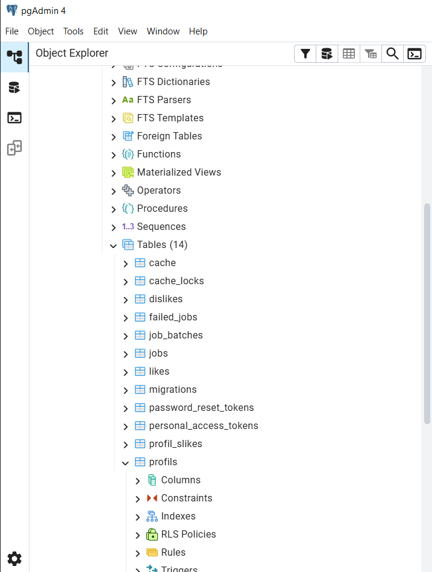

# ❤️ DatingApp – Laravel Web Application

DatingApp je web aplikacija za upoznavanje korisnika razvijena pomoću **Laravel framework-a**.
Aplikacija omogućava registraciju korisnika, kreiranje profila, pregled drugih korisnika, lajkove, dislajkove i pronalaženje međusobnih podudaranja (**match sistem**).

---

## 📌 Osnovne funkcionalnosti

- ✔ Registracija i prijava korisnika
- ✔ Kreiranje i uređivanje profila
- ✔ Upload profilne slike
- ✔ Galerija slika korisnika
- ✔ Pregled drugih korisnika
- ✔ Like / Dislike sistem
- ✔ Match sistem
- ✔ Undo like/dislike
- ✔ Statistika korisnika
- ✔ Eksterni API (mapa lokacija korisnika)

---

## 🛠 Korištene tehnologije

- Laravel 10 – PHP framework za brzi razvoj web aplikacija
- PHP – serverski jezik za dinamičke web stranice
- MySQL – relacijska baza za čuvanje podataka
- Blade Templates – Laravel-ovi HTML šabloni sa PHP logikom
- Tailwind CSS – brzo stilizovanje pomoću utility klasa
- Jetstream Auth – gotov sistem za login, registraciju i 2FA
- Leaflet.js – lagana JavaScript biblioteka za interaktivne mape

---

## 🗄 Baza podataka

Aplikacija koristi relacijsku bazu podataka sa sljedećim tabelama:

- users
- profils
- profil_slikes
- likes
- dislikes

---

## 🌱 Seeders i Factories

Projekt sadrži:

✔ Factories za:

- User
- Profil
- ProfilSlika
- Like
- Dislike

✔ Seeders koji generišu:

- 10 korisnika
- 10 profila
- galerije slika
- like/dislike odnose

Pokretanje seedera:

```
php artisan migrate:fresh --seed
```

---

## 👤 Korisnički profil

Svaki korisnik može imati jedan profil koji sadrži:

- ime
- prezime
- datum rođenja
- spol
- grad
- opis
- profilnu sliku
- galeriju slika
- interesovanja
- minimalne godine partnera
- maksimalne godine partnera

---

## ❤️ Match sistem

Korisnici mogu:

- lajkovati profile
- dislajkovati profile
- poništiti like/dislike

Match nastaje kada:

✔ dva korisnika lajkuju jedan drugog

U match sekciji moguće je:

- vidjeti match korisnike
- otvoriti chat (demo verzija)

---

## 🖼 Galerija slika

Korisnici mogu:

- ✔ upload više slika
- ✔ brisati slike
- ✔ pregledati galeriju drugih korisnika

---

## 📊 Statistika

Dashboard prikazuje:

- ✔ broj korisnika
- ✔ procent muškaraca i žena
- ✔ starosnu strukturu
- ✔ prosječnu starost
- ✔ najčešće gradove

---

## 🗺 Mapa korisnika (External API)

Dashboard sadrži mapu koja prikazuje:

- ✔ gradove korisnika
- ✔ raspored korisnika po lokacijama

Koristi se:

Leaflet.js API

---

## 📷 Screenshots

### Login

<p align="center">
  
</p>

---

### Registracija

<p align="center">
  
</p>

---

### Kreiranje računa

<p align="center">
  
</p>
<p align="center">
  
</p>

---

### Dashboard

<p align="center">
  
</p>
<p align="center">
  
</p>
<p align="center">
  
</p>

---

### Pregled profila

<p align="center">
  
</p>

---

### Moj profil

<p align="center">
  
</p>
<p align="center">
  
</p>

---

### Profili ostalih korisnika

<p align="center">
  
</p>
<p align="center">
  
</p>

---

### Match sistem

<p align="center">
  
</p>
<p align="center">
  
</p>

---

---

## 🚀 Pokretanje projekta

1️⃣ Kloniranje projekta

```
git clone https://github.com/tvoj-username/datingapp.git
```

2️⃣ Instalacija

```
composer install
```

3️⃣ Konfiguracija

```
cp .env.example .env
```

4️⃣ Generisanje ključa

```
php artisan key:generate
```

5️⃣ Migracije i seeders

```
php artisan migrate:fresh --seed
```

6️⃣ Pokretanje servera

```
php artisan serve
```

---

## 🔐 Autentifikacija

Aplikacija koristi:

Laravel Jetstream Authentication

Omogućeno:

- ✔ Registracija
- ✔ Login
- ✔ Logout
- ✔ Email verifikacija

---

🐘 PostgreSQL

PostgreSQL je napredni relacijski sistem za upravljanje bazom podataka koji koristi relacijski model i SQL jezik. U odnosu na MySQL nudi proširene mogućnosti i veću fleksibilnost pri radu sa podacima.

Karakteristike:

relacijski model podataka

podrška za napredne tipove podataka

stabilan i pouzdan sistem

podrška za kompleksne SQL upite

kompatibilnost sa Laravel ORM sistemom

Zbog velike sličnosti sa MySQL bazom podataka, migracija aplikacije DatingApp sa MySQL-a na PostgreSQL ne zahtijeva izmjene aplikacione logike.

Laravel Eloquent ORM omogućava nezavisnost aplikacije od konkretnog sistema baze podataka, pa je prelazak moguć uz minimalne izmjene konfiguracije.

🍃 MongoDB

MongoDB je NoSQL baza podataka koja koristi dokumentni model podataka umjesto relacijskog modela zasnovanog na tabelama.

Karakteristike:

podaci se čuvaju u JSON dokumentima

nema klasičnih tabela i relacija

fleksibilna struktura podataka

mogućnost ugniježđavanja podataka

nema stranih ključeva niti JOIN operacija

Za razliku od MySQL i PostgreSQL baza podataka, MongoDB zahtijeva drugačiji pristup modeliranju podataka i implementaciji relacija između entiteta.

🗄️ Izbor i implementacija baze podataka

U okviru projekta analizirani su različiti sistemi za upravljanje bazama podataka, uključujući:

MySQL

PostgreSQL

MongoDB

Relacijski sistemi koriste strukturirani model podataka zasnovan na tabelama i jasno definisanim relacijama između entiteta, dok MongoDB koristi dokumentni model sa fleksibilnom strukturom podataka.

U implementaciji DatingApp aplikacije korištena je relacijska baza podataka, u kojoj su podaci organizovani u više međusobno povezanih tabela.

Ovakav pristup omogućava:

jasno definisane odnose između entiteta

očuvanje integriteta podataka

jednostavno upravljanje korisnicima i profilima

stabilan rad aplikacije

Podaci su organizovani u tabelama koje omogućavaju upravljanje:

👤 korisnicima
💑 profilima korisnika
🖼️ galerijom slika
❤️ lajkovima
❌ dislajkovima

📊 Glavni entiteti i struktura sistema

U nastavku je prikazan pregled glavnih entiteta baze podataka zajedno sa njihovim osnovnim atributima.

Entitet Opis Ključni atributi
👤 User Registrovani korisnik aplikacije name, email, password
💑 Profil Dating profil korisnika user_id, ime, prezime, datum_rodjenja, spol, grad, opis, profilna_slika, zainteresovan_za, min_godine, max_godine
🖼️ ProfilSlika Galerija slika korisnika profil_id, path
❤️ Like Evidencija lajkovanih profila user_id, profil_id
❌ Dislike Evidencija dislajkovanih profila user_id, profil_id
🔗 Relacijska struktura sistema
Entitet 1 Tip relacije Entitet 2 Objašnjenje
👤 User 1 : 1 💑 Profil Svaki korisnik ima jedan profil
💑 Profil 1 : N 🖼️ ProfilSlika Jedan profil može imati više slika
👤 User 1 : N ❤️ Like Korisnik može lajkovati više profila
👤 User 1 : N ❌ Dislike Korisnik može dislajkovati više profila
💑 Profil 1 : N ❤️ Like Profil može biti lajkovan od više korisnika
💑 Profil 1 : N ❌ Dislike Profil može biti dislajkovan od više korisnika
💡 Funkcionalna logika sistema

DatingApp aplikacija omogućava korisnicima:

registraciju i prijavu u sistem

kreiranje i uređivanje profila

pregled drugih profila

lajkovanje i dislajkovanje profila

pronalaženje match-eva

pregled statistike korisnika

pregled galerije slika

Match sistem funkcioniše tako što:

korisnik A lajkuje korisnika B

korisnik B lajkuje korisnika A

sistem prepoznaje međusobni lajk i formira match

---

🔄 Migracija baze podataka – MySQL → PostgreSQL

DatingApp aplikacija je prilagođena radu sa PostgreSQL bazom podataka kao alternativom MySQL sistemu.

Za administraciju baze korišten je alat pgAdmin, koji omogućava jednostavno upravljanje PostgreSQL serverom i bazama podataka.

Zahvaljujući Laravel Eloquent ORM-u, prelazak sa MySQL baze na PostgreSQL bazu nije zahtijevao izmjene u aplikacionoj logici. ORM omogućava apstrakciju baze podataka, pa aplikacija može raditi sa različitim bazama uz minimalne izmjene konfiguracije.

🛠️ Kreiranje baze u pgAdmin-u

Migracija na PostgreSQL obuhvata sljedeće korake:

Instalacija PostgreSQL servera

Kreiranje baze podataka u pgAdmin-u

Konfigurisanje pristupa bazi

Povezivanje Laravel aplikacije sa PostgreSQL bazom

Nakon kreiranja baze potrebno je izmijeniti .env konfiguraciju:

DB_CONNECTION=pgsql
DB_HOST=127.0.0.1
DB_PORT=5432
DB_DATABASE=dating
DB_USERNAME=postgres
DB_PASSWORD=12345678

⚙️ Koraci nakon izmjene .env fajla

Nakon promjene baze potrebno je izvršiti sljedeće komande.

1️⃣ Očistiti konfiguracioni cache
php artisan config:clear

Po potrebi:

php artisan cache:clear
php artisan optimize:clear
2️⃣ Pokrenuti migracije
php artisan migrate

Ova komanda kreira sve tabele definisane migracijama unutar PostgreSQL baze.

3️⃣ Popuniti bazu testnim podacima
php artisan db:seed

ili:

php artisan migrate:fresh --seed

Seederi automatski kreiraju:

korisnike

profile

slike profila

like/dislike odnose

---

<p align="center">
  
</p>

---

📦 Funkcionisanje relacija u PostgreSQL-u

Sve relacije definisane u aplikaciji ostaju nepromijenjene:

primarni i strani ključevi rade identično

one-to-many relacije (Profil → Slike)

one-to-many relacije (User → Profil)

like/dislike relacije između profila

Struktura baze ostaje relacijska i konzistentna.

🎯 Zaključak migracije

Migracija DatingApp aplikacije sa MySQL na PostgreSQL:

✔ ne zahtijeva izmjene modela
✔ ne zahtijeva izmjene kontrolera
✔ ne zahtijeva izmjene relacija
✔ ne utiče na funkcionalnost aplikacije
✔ zahtijeva samo promjenu konfiguracije baze

Zahvaljujući Laravel Eloquent ORM-u, prelazak na PostgreSQL je jednostavan i stabilan.

---

## 🍃 Migracija aplikacije DatingApp na MongoDB

Migracija DatingApp aplikacije sa relacijske baze (MySQL/PostgreSQL) na MongoDB nije samo promjena DB_CONNECTION, nego zahtijeva promjenu načina čuvanja podataka i relacija.

MongoDB je dokumentna baza (kolekcije + JSON dokumenti), što znači:

❌ nema stranih ključeva

❌ nema JOIN-ova

❌ nema pivot tabela

✅ relacije se održavaju u aplikaciji (kod)

✅ često se koristi ugniježđavanje (embed) podataka u isti dokument

Relacije su:

users (Jetstream/Fortify auth)

profils (dating profil)

profil_slikes (galerija)

likes

dislikes

(match sistem je izveden iz likes/dislikes)

# ⚙️ Instalacija i konfiguracija

1. Instalacija paketa
   composer require mongodb/laravel-mongodb
2. .env konfiguracija
   DB_CONNECTION=mongodb
   DB_HOST=127.0.0.1
   DB_PORT=27017
   DB_DATABASE=dating
3. config/database.php

Dodaje se mongodb konekcija:

'mongodb' => [
'driver' => 'mongodb',
'host' => env('DB_HOST', '127.0.0.1'),
'port' => env('DB_PORT', 27017),
'database' => env('DB_DATABASE'),
],

4. Alati za rad s MongoDB

MongoDB Compass (najlakše vizuelno)

MongoDB Atlas (cloud)

mongosh (terminal)

# 🧱 Izmjene u modelima (DatingApp)

📌 Profil model (MongoDB)

use MongoDB\Laravel\Eloquent\Model;

class Profil extends Model
{
protected $connection = 'mongodb';

    protected $fillable = [
        'user_id',
        'ime',
        'prezime',
        'datum_rodjenja',
        'spol',
        'grad',
        'opis',
        'profilna_slika',
        'zainteresovan_za',
        'min_godine',
        'max_godine',
        'slike',         // <- niz slika (gallery)
    ];

    protected $casts = [
        'slike' => 'array',
    ];

}
Primjer dokumenta profils kolekcije
{
"\_id": "65ab...",
"user_id": "65aa...",
"ime": "Sajra",
"prezime": "Al",
"grad": "Sarajevo",
"spol": "zensko",
"profilna_slika": "profili/demo1.jpg",
"slike": [
{"path": "profili/demo2.jpg"},
{"path": "profili/demo3.jpg"}
],
"zainteresovan_za": "musko",
"min_godine": 20,
"max_godine": 30
}

✅ Prednost: nema posebne kolekcije profil_slikes (jednostavnije).
❌ Mana: ako imaš puno slika (50+), dokument raste.

## ❤️ Like/Dislike struktura u MongoDB

likes : { user_id, profil_id }

dislikes : { user_id, profil_id }

Samo što MongoDB ne koristi foreign key — to su samo ID vrijednosti.

# 🧑‍💻 Izmjene u kontrolerima

1. BrowseController@index

Relacijski model:

uzme sve profile

izbaci one koje si lajkao/dislajkao

prikaže prvi ili listu

MongoDB:

isto, ali nema join-a, nego:

uzmeš likedIds iz likes kolekcije

uzmeš dislikedIds iz dislikes kolekcije

filtriraš profile po \_id not in (...)

2. BrowseController@like

Relacijski:

Like::create([
'user_id' => auth()->id(),
'profil_id' => $id
]);

MongoDB je identično, samo Like model ide na mongodb konekciju.

# 🖼️ ProfilSlikaController (galerija)

U relacijskoj bazi:

imaš posebnu tabelu profil_slikes

profil_id kao FK

U MongoDB (preporuka):

slike su dio profila: slike: [ {path}, {path} ]

brisanje slike = izbacivanje elementa iz niza (array pull)

Pseudo-primjer:

$profil->slike = collect($profil->slike)
->reject(fn($s) => $s['path'] === $pathToDelete)
->values()
->toArray();

$profil->save();

# 🌱 Factory i Seeder (kako bi izgledalo u MongoDB)

User::factory(10)

Profil + slike

Like/Dislike random

U MongoDB bi se to pojednostavilo jer se slike mogu embedovati u profil dokument.

ProfilFactory bi direktno imao:
'slike' => [
['path' => 'profili/demo1.jpg'],
['path' => 'profili/demo2.jpg']
]
Seeder:

kreira usera

kreira profil dokument za usera (sa slikama)

generiše liked_profils/disliked_profils ili Like/Dislike dokumente

🎯 Zaključak (DatingApp + MongoDB)

Migracija DatingApp aplikacije na MongoDB bi:

✅ pojednostavila galeriju (slike u profilu kao niz)
✅ smanjila broj tabela/kolekcija (ako embeduješ)
❌ zakomplikovala match logiku (nema join-a, sve ručno u kodu)
❌ tražila prilagodbu modela i kontrolera (posebno Browse/Match)

---

## 👨‍💻 Autor

Ime i prezime: Sajra Alijagić

Predmet: Objektno orijentirane baze podataka

Godina: 2026

---

## 📄 Napomena

Ovaj projekat je razvijen u edukativne svrhe kao studentski projekat.
